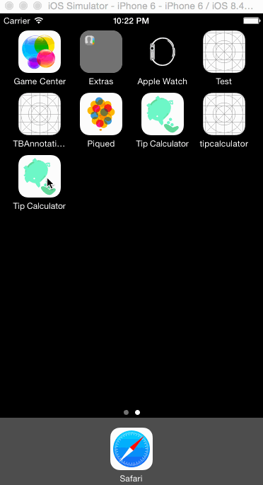

# TipCalculator

This is a Tip Calculator application for iOS submitted as the [pre-assignment](https://gist.github.com/timothy1ee/7747214) requirement for CodePath.

Time spent: 15

Completed:

* [x] Required: User can enter a bill amount, choose a tip percentage, and see the tip and total values.
* [x] Required: Settings page to change the default tip percentage.
* [x] Optional: Remembering the bill amount across app restarts (if <10mins)
* [x] Optional: Using locale-specific currency and currency thousands separators.
* [x] Optional: Making sure the keyboard is always visible and the bill amount is always the first responder. This way the user doesn't have to tap anywhere to use this app. Just launch the app and start typing.
* [x] Additional: Remembering last tip percentage across app restarts
* [x] Additional: User can choose a tip percentage between 0 and 100
* [x] Additional: You can select default locale to change currency and thousands separators.

Further notes:
- A custom class has been created for CurrencyTextFields, to force input to always have 2 decimal places.
- The bill splitting feature is not implemented, nor is clear, in the interest of time, though I've completed these in the original app in Objective C.